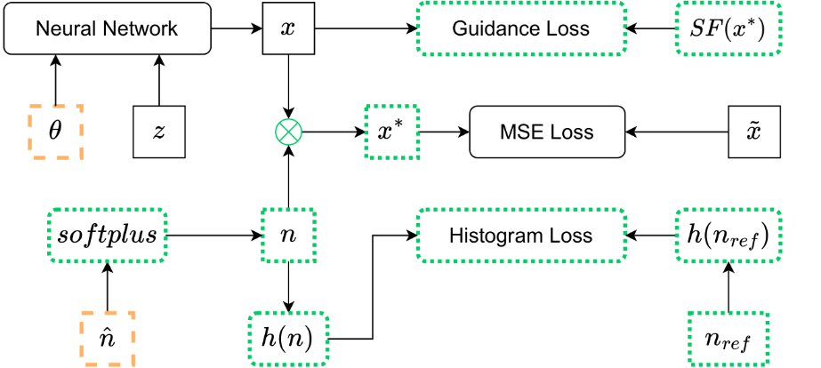

<!--  -->

# S3DIP
This is the official repository of the paper [_'Self-Supervised Sar Despeckling Using Deep Image Prior'_](https://www.sciencedirect.com/science/article/pii/S0167865525000637), by Chiara Albisani, Daniele Baracchi, Alessandro Piva and Fabrizio Argenti.

# Overview

<p align="center">
  
</p>

Speckle noise produces a strong degradation in SAR images, characterized by a multiplicative model. Its removal is an important step of any processing chain exploiting such data. To perform this task, several model-based despeckling methods were proposed in the past years as well as, more recently, deep learning approaches. However, most of the latter ones need to be trained on a large number of pairs of noisy and clean images that, in the case of SAR images, can only be produced with the aid of synthetic noise. In this paper, we propose a self-supervised learning method based on the use of Deep Image Prior, which is extended to deal with speckle noise. The major advantage of the proposed approach lies in its ability to perform denoising without requiring any reference clean image during training. A new loss function is introduced in order to reproduce a multiplicative noise having statistics close to those of a typical speckle noise and composed also by a guidance term derived from model-based denoisers. Experimental results are presented to show the effectiveness of the proposed method and compare its performance with other reference despeckling algorithms.


# Requirements

You can install all packages through the environment.yml which is provided in the folder. First change the `prefix` path with your own path to Miniconda in the file. After doing that you can type this command: 
``` 
conda env create -f environment.yml
```
As an alternative, you can manually create the environment through these commands:

``` 
conda create -n s3dip python=3.7
conda activate s3dip
pip install -r requirements.txt
```

[Comet.ml](https://www.comet.ml/site/) support is present to monitor the training and validation metrics. A registration is needed (you can use the Github account). There are [many ways](https://www.comet.ml/docs/python-sdk/advanced/#python-configuration) to integrate comet support in a project, but we suggest to save the API key generated, as described [here](https://www.comet.ml/docs/quick-start/), in a .comet.config file and to copy the following lines in your script:
```
import comet_ml
experiment = comet_ml.Experiment()
```


# Usage

In this section you can find the instructions for running the scripts for both synthetic and real SAR images. Example files are stored in test_data and test_data_real folders, respectively. 
It is important to use as histogram the one that corresponds to the speckle distribution we would like to remove. This means that if you have an image with number-of-looks equal to one (L=1), you have to set ```--histogram_path ./test_data/histograms/L1/h_ref_192.pckl``` , while if you have a L=4 image, you must use ```--histogram_path ./test_data/histograms/L4/h_ref_192.pckl```.
<!--It is useful to set ```--comet 0``` when you run the experiments through bash scripts -->
<!-- script per generare l'istogramma con diversi bin  -->

## Synthetic Data

Assume this folders layout for : 
``` 
test_data
├── histograms
    ├── L1
        ├── h_ref_192.pckl
    ├── L4
        ├── h_ref_192.pckl
├── L1
    ├── mat_files
        ...
    ├── pckl_files
        ├── buildings
            ├── buildings34_01.pckl
    ├── SAR-BM3D
        ├── pckl_files
            ├── buildings
                ├── buildings34_01_sar-bm3d.pckl   
    ├── FANS
        ├── pckl_files
            ├── buildings
                ├── buildings34_01_fans.pckl
├── L4
    ...
```
Here buildings34_01.pckl is an example image belonging to class buildings of the UCMerced_LandUse dataset used for the synthetic experiments. The pickle file contains both the noisy and the clean instance of the image.

Example:
- S3DIP
  ``` 
  python s3dip.py 
    --pkl ./test_data/L1/pckl_files/buildings/buildings34_01.pckl 
    --name_exp buildings34_s3dip --iter 10000 --plot_step 1000 
    --base_save_path ./test_save_data/synthetic/s3dip 
    --h_path ./test_data/histograms/L1/h_ref_192.pckl --loss_fusion 1 --comet 1
    --base_dataset_path ./test_data/L1
  ``` 
- DIP (for comparison)
  ``` 
  python dip.py 
    --pkl ./test_data/L1/pckl_files/buildings/buildings34_01.pckl 
    --name_exp buildings34_s3dip --iter 5000 --plot_step 1000 
    --base_save_path ./test_save_data/synthetic/dip --comet 1
    --base_dataset_path ./test_data/L1
  ``` 

## Real SAR Data

Assume this folders layout for : 
``` 
test_data_real
├── L1
    ├── dataset_no_SLC
    ├── dataset_SLC
      ├── COSMO-SkyMed
          
          ├── FANS
              ├── pckl_files
                  ├── cskm_cascine_01_fans.pckl
          ├── pckl_files
                  ├── cskm_cascine_01.pckl
          ├── SAR-BM3D
              ├── pckl_files
                  ├── cskm_cascine_01_sar-bm3d.pckl   
├── L4
    ...
```

Example:
- S3DIP
  ``` 
  python s3dip_real.py 
    --pkl ./test_data_real/L1/dataset_SLC/COSMO-SkyMed/pckl_files/cskm_cascine_01.pckl
    --name_exp cskm_cascine_s3dip --iter 10000 --plot_step 1000 
    --base_save_path ./test_save_data/real/s3dip 
    --h_path ./test_data/histograms/L1/h_ref_192.pckl --loss_fusion 1 --comet 1
    --base_dataset_path ./test_data_real/L1/dataset_SLC
  ``` 
- DIP (for comparison)
  ``` 
  python dip_real.py 
    --pkl ./test_data_real/L1/dataset_SLC/COSMO-SkyMed/pckl_files/cskm_cascine_01.pckl
    --name_exp cskm_cascine_dip --iter 5000 --plot_step 1000 
    --base_save_path ./test_save_data/real/dip --comet 1
    --base_dataset_path ./test_data_real/L1/dataset_SLC
  ``` 

## Test the code on new data

If you want to test the code on new data there are some pre-processing steps to do which also involve the usage of Matlab.
- Synthetic Data: 
  1) Generate the noisy images corresponding to your data, executing ```./pre_processing/compute_speckle_images_fromtxt.m``` , changing the input path of the txt file (file_path) with the list of the images and the output directory where to save your dataset (output_base_dir).
  2) Convert the mat files to pickle executing the function convert_mat2pickle(input_folder, dest_folder) in functions.py
  3) Generate the denoised images for your dataset using SAR-BM3D and FANS, executing ```./pre_processing/compute_despeckled_images_from_mat.m```, changing the paths opportunely. This file assumes you have downloaded the SAR-BM3D [link](https://www.grip.unina.it/download/prog/SAR-BM3D/version_1.0/) and FANS [link](https://www.grip.unina.it/download/prog/FANS/) codes and you have add them to the MATLAB search path (using Set_path from MATLAB HOME interface)
  4) Convert the mat files to pickle executing the function convert_mat2pickle_sarbm3d_fans(base_input_folder, base_dest_folder, method) in functions.py

- Real SAR Data:
  1) Normalize your images using the 99th percentile and save it as a .mat file. You can find the pre-processing step for both Single Look Complex images (complex data, L=1) and no complex images in ```./pre_processing/pre_process_real_images.m```.
  2) Convert the mat files to pickle executing the function convert_mat2pickle(input_folder, dest_folder) in functions.py
  3) Generate the denoised images for your dataset using SAR-BM3D and FANS, executing ```./pre_processing/compute_despeckled_images_from_mat.m```, changing the paths opportunely. 
  4) Convert the mat files to pickle executing the function convert_mat2pickle_sarbm3d_fans(base_input_folder, base_dest_folder, method) in functions.py

  
- Histogram
  If you want to generate a new histogram, you have to generate a random Rayleight matrix executing ```./pre_processing/speckleNoise.m``` with a size of 10000x10000 for example, and then computing the histogram as in ```hist_loss_no_broadcast.py``` specifyng the desired number of bins. This file provides an implementation of the differentiable histogram without using the tensors facilities of Pytorch as in ```hist_loss_broadcast.py```. This is done for speed reasoning. 

# TODO

- [ ] 🔄 Add bash script for reproducing the results
- [ ] 🔧 Add pre-processing scripts
- [ ] 📂 Upload dataset files
- [ ] 🚀 Improve execution efficiency
- [ ] 📝 Update README with instructions


# Citation

``` 
@article{ALBISANI2025169,
  title = {Self-Supervised SAR Despeckling Using Deep Image Prior},
  journal = {Pattern Recognition Letters},
  volume = {190},
  pages = {169-176},
  year = {2025},
  issn = {0167-8655},
  doi = {https://doi.org/10.1016/j.patrec.2025.02.021},
  url = {https://www.sciencedirect.com/science/article/pii/S0167865525000637},
  author = {Chiara Albisani and Daniele Baracchi and Alessandro Piva and Fabrizio Argenti},
  keywords = {Image restoration, Despeckling, Deep learning, Deep image prior},
}
```
